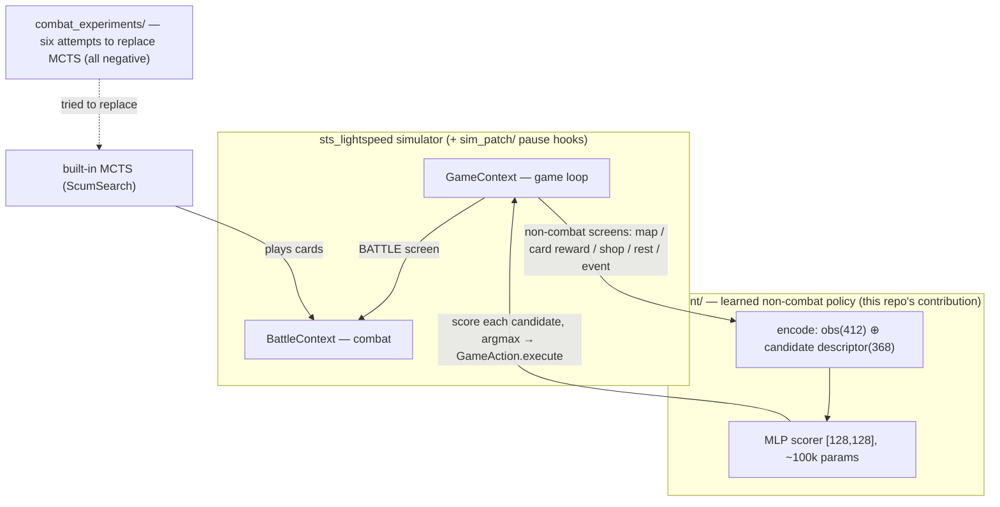

# sts-rl-agent — a learned policy for Slay the Spire (on sts_lightspeed)

English | [中文](README.zh-CN.md)

A hybrid agent for **Slay the Spire** (A0 Ironclad) built on the
[sts_lightspeed](https://github.com/gamerpuppy/sts_lightspeed) simulator:

- **A small learned network (~100k params) makes ALL non-combat decisions** — map pathing, card rewards, shops, campfires, events — trained from scratch with REINFORCE.
- **MCTS (the simulator's built-in ScumSearch) plays combat.**

To our knowledge this is the first working learned policy published for sts_lightspeed's
neural-network interface (the simulator ships a 412-dim `NNInterface` observation but no
trained weights). It is **not** SOTA at the game and it does not claim to be — see honest
limitations below.

## Headline result

Same MCTS combat, same 50 held-out seeds, A0 Ironclad — only the non-combat "brain" differs:

| non-combat decisions | combat | avg floor | win rate |
|---|---|---|---|
| built-in heuristics (map = random) | MCTS @2000 | 22.8 | 2% |
| built-in heuristics (map = random) | MCTS @50000 | 31.2 | 6% |
| **learned policy (this repo)** | MCTS @2000 | **38.5** | 4% |
| **learned policy (this repo)** | MCTS @50000 | **42.5** | **14%** |

The learned non-combat layer is worth **~11 floors** over the stock bot's heuristics —
its biggest weakness was never combat, it was walking the map at random.

## Architecture



The game loop routes by screen: non-combat decisions go through the learned scorer
(score every legal candidate, pick the argmax), combat stays with search. `combat_experiments/`
documents our six failed attempts to learn combat too — published as honest negative results.

## What's in here

```
agent/                 non-combat policy (the thing that works)
  armG_train.py            unified scorer: f(obs412 ⊕ candidate-descriptor) → score
  armG_train_parallel.py   12-worker REINFORCE trainer (random seeds, fixed eval set, checkpoints)
  armS_train*.py           earlier card-reward-only policy (ceiling ≈ floor 35)
combat_experiments/    six attempts to learn COMBAT — all negative results, published on purpose
  armB_train*.py           behavior cloning of MCTS  → imitation acc 0.59, floor ~12
  armB_dagger.py           DAgger                     → no improvement (labels not learnable)
  armB_rl.py               REINFORCE fine-tune        → floor ~12
  armB_attn*.py            attention/token scorer     → floor ~14
  armB_value*.py           value net + 1-ply lookahead→ floor ~8 (worse than no lookahead)
  armB_mcts.py             policy+value guided PUCT   → scales with sims, but LOSES to
  armB_selfplay.py         blind MCTS at equal budget (26.7 vs 33 @100 sims)
eval/                  evaluation protocol
  eval_seeds_50.txt        fixed 50 held-out seeds used for every number in this README
  armB_blind.py            hybrid agent eval (learned non-combat + MCTS combat), ASC env for difficulty
  native_bot_eval.py       stock ScumSearch bot on the same seeds (the baseline above)
  death_analysis.py        where runs die (spoiler: boss fights)
weights/               trained weights (small MLPs, <2MB each)
  armG_model_G128x128_15k.pt   ← the non-combat policy behind the headline number
sim_patch/             changes needed on top of sts_lightspeed
  sim_rl_hooks.patch
```

## The interesting negative result

We tried six ways to distill MCTS combat into a feed-forward network. All failed the same way:

- Imitation learning can't fit the teacher (train accuracy caps at ~0.44): MCTS rollouts use
  the true future draw order — **the teacher effectively sees the future**, a one-frame policy can't.
- RL, attention, and value-lookahead all plateau far below the teacher.
- A policy/value-guided PUCT search does scale with compute, but at **equal search budget the
  learned guidance loses to blind rollouts** — half-trained networks mislead the tree.

Takeaway: *judgment*-type decisions (pathing, shopping, deck-building) compress into small
networks easily; *planning*-type decisions (combat card sequencing) resist — they seem to need
a full AlphaZero-style self-play loop, which nobody has published for this game yet. That's
the open territory.

Difficulty ladder for the hybrid agent (sim2000): A0 38.5 → A5 33.4 → A10 30.1 → A20 25.7
(0% win at A20; top humans exceed 50%).

## Reproduce

1. Clone [sts_lightspeed](https://github.com/gamerpuppy/sts_lightspeed) and apply the patch
   (adds `pause_on_map/rest/shop/event/battle` hooks, a generic `GameAction` binding,
   `get_legal_game_actions`, `mcts_recommend` oracle, card-pile access):

   ```bash
   git clone https://github.com/gamerpuppy/sts_lightspeed && cd sts_lightspeed
   git checkout 7476a81
   git apply /path/to/sim_patch/sim_rl_hooks.patch
   mkdir build312 && cd build312 && cmake .. && make -j4   # needs pybind11 submodule + python3.12
   ```

2. Point the scripts at your build (each script has `SB`/`sys.path` at the top) and run:

   ```bash
   # evaluate the shipped non-combat policy + MCTS combat on the 50 eval seeds
   python eval/armB_blind.py 2000,50000 12
   # train the non-combat policy from scratch (~10 min on a laptop, 12 cores)
   STS_SIM_COUNT=2000 PROG_TAG=my_run python agent/armG_train_parallel.py 8000 12 32
   ```

Python deps: `torch`, `tensorboard` (training only). Scripts are research code — paths are
plain constants, edit them to your layout.

Weights are mirrored on HuggingFace: [Jialeiv/sts-rl-agent](https://huggingface.co/Jialeiv/sts-rl-agent).

## Honest limitations

- A0 (lowest difficulty), Ironclad only — the simulator only fully implements Ironclad
  (other characters' cards are stubs upstream).
- Combat is still search (MCTS), not learned. The learned part is everything *around* combat.
- "Strongest public bot" = the stock sts_lightspeed ScumSearch agent measured on our seeds;
  numbers elsewhere may differ with different seed sets.
- Single-run numbers on 50 fixed seeds; no confidence intervals.

## Credits & license

- Simulator: [gamerpuppy/sts_lightspeed](https://github.com/gamerpuppy/sts_lightspeed) (MIT) —
  this project would not exist without it.
- This repo: MIT. Slay the Spire is a trademark of Mega Crit Games; this is an unaffiliated
  research project on a clean-room simulator.

Story write-up (Chinese): see the accompanying blog series by *Slow Take*.
