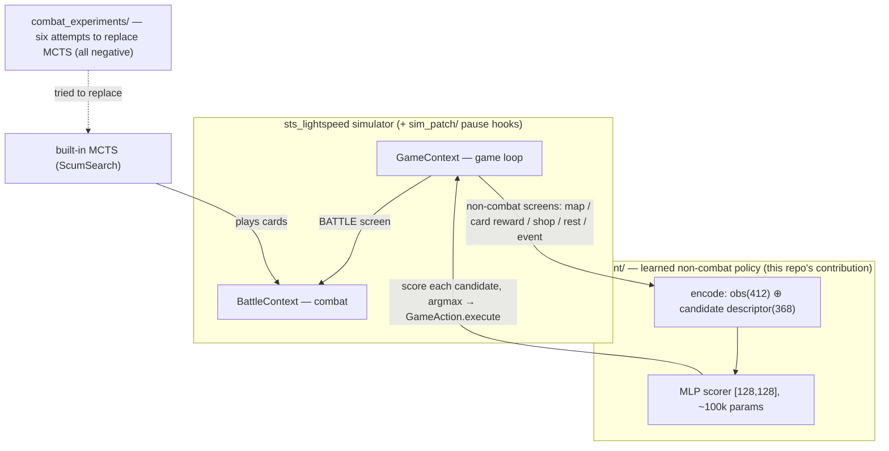

# sts-rl-agent — a learned policy for Slay the Spire (on sts_lightspeed)

English | [中文](README.zh-CN.md)

A hybrid agent for **Slay the Spire** (A0 Ironclad) built on the
[sts_lightspeed](https://github.com/gamerpuppy/sts_lightspeed) simulator:

- **A small learned network (~100k params) makes ALL non-combat decisions** — map pathing, card rewards, shops, campfires, events — trained from scratch with REINFORCE.
- **MCTS (the simulator's built-in ScumSearch) plays combat.**

To our knowledge this is the first working learned policy published for sts_lightspeed's
neural-network interface (the simulator ships a 412-dim `NNInterface` observation but no
trained weights). It is **not** SOTA at the game and it does not claim to be — see honest
limitations below.

The headline results and shipped weights below use the historical A0 interface. The current
A20-to-Heart development path expands the observation and action contracts; its validation
status and remaining gates are documented under [`sim_patch/alignment/`](sim_patch/alignment/).

**Current development (September 20): E110/E111 repair generated-card costs and victory state.** The preselected failure seed repeats a natural Heart win; 203 outside decisions and 1,065 original commands match through three keys, both Act 3 bosses, Shield/Spear and Heart at 62 HP. All 250 regression tests and twelve terminal RNG checks pass. E107 stays stopped, and E108/E109 old-source training stays closed. E112 registers regeneration on the same 6,144 families, with an added terminal RNG gate. The data-scale hypothesis and 50% unseen-win goal remain open; long-job observations use 20-minute intervals. [Repair result](sim_patch/alignment/e111-post-victory-exhaust-report.json), [current status](docs/ironclad-training-status.md).

E89 finished its joint relic/card experiment without a candidate passing the fixed adoption gate. All 6,324 first-relic and 25,188 joint continuations passed simulator audits with zero execution faults. The three arms completed 27,000 cross-validation optimizer updates; the strongest joint result was 165/1,536 versus 155, with 43 added wins and 33 lost wins (paired exact p=0.3019). Final refit updates and natural candidate games are zero. E95 verifies that saved heads improve their fit families without transferring this gain to held-out families. E96 paired-return regression also failed all nine internal screens; no diagnostic head was deployed. The repaired E87 baseline remains 248/2,560 Heart wins; its 48 development-winning original routes matched in E88. These results do not establish exhaustive parity or unseen acceptance. The 50% goal remains open; see [current training status](docs/ironclad-training-status.md), [E89 result](docs/experiments/e89-joint-refresh-result.json) and [E95 diagnosis](docs/experiments/e95-readout-diagnosis-result.json).

The historical selected A20-to-Heart policy is **E60** (September 18, 2026). On the same 1,024
fresh root seeds, the original outside policy won **83/1,024 Hearts (8.1055%)**;
learning the first-act boss-relic choice raised this to **112/1,024 (10.9375%)**.
There were 40 added wins and 11 lost wins, a net gain of 29 (paired exact
p = 5.7038e-5). Both arms share the bounded-replanning combat engine and
8,000 simulations per search (bosses ×3). Total search work increased **0.69%**.

The learned component is a score for each of 22 relics and skipping, trained on
matched complete continuations. The original 1,061,953-parameter network controls
all later outside choices and retains its weights. All 2,048 natural terminals
passed state/RNG replay; all 195 winning arm/seed runs reproduced NN/MCTS planning
and passed the key, double-boss, Act Four and outside-decision audits. Execution
faults were zero. The frozen adoption gate and the **observed 10% target pass**;
the candidate's 95% Wilson interval is **9.17%–13.00%**, so this does not establish
a population lower bound of 10%. Full original-Java parity remains incomplete.

The **E61 independent retest** kept both policies and the combat runtime unchanged.
On another 1,024 unseen seeds, the original policy won **92/1,024 (8.9844%)**
and the selected model won **121/1,024 (11.8164%)**: 47 added wins, 18 lost,
net +29, paired exact p = 0.00042213. All 2,048 terminal replays and 213 winner
replans passed, with zero game faults. The registered replication and observed
10% gates pass; the candidate's 95% Wilson interval is **9.98%–13.94%**.
This is a separate test cohort, with no retraining or new model selection.
See the [E61 results and reporting-error correction](runs/heart-first-boss-retest-20260918-01/复测结果.md).

**E62 original-game parity did not pass.** Replaying those 121 simulator-winning
traces from natural original-game starts found 91 behavior/RNG differences,
7 card-choice observation differences, 19 cost-state differences with conditional
downstream impact, and 4 shop-availability differences caused by excluding
Prismatic Shard. Each trace stopped at its first observed divergence, without an
original-game win/loss label. The 11.8164% result remains a simulator measurement;
it does not establish the original-game win rate. See the
[E62 evidence and coverage limits](../ironclad-alignment/evidence/e61-success-parity-20260918-01/一致性核验结果.md).

Use the [selected frozen runtime](runs/heart-first-boss-confirmation-20260918-01/selected-runtime.json)
with `agent/heart_play_selected.py --selection <selection.json> --seed <seed> --output <new-directory>`
in a macOS arm64 Python 3.12 environment with PyTorch. It checks the engine,
model and experiment identities and saves a replay-verified complete game.
See [E60 results and reproduction](runs/heart-first-boss-confirmation-20260918-01/验收结果.md),
the [learned policy](agent/heart_boss_relic_model.py), and the
[bounded replanning patch](sim_patch/search_replanning_limit.patch). A known-seed
entry check reproduced a complete Heart win and all 208 outside decisions.

The prior E54 combat comparison scored 34→68/1,024 on its own fresh cohort;
those counts are not a paired baseline for E60. Its
[results and source patch](runs/heart-bounded-loss-confirmation-20260918-01/验收结果.md)
remain recorded. E55's execution failure, E56's blocked training, and E57's
rejected unconditional terminal-plan execution retain their original decisions.
The following paragraphs retain each experiment's historical scope.

The initial A20 capacity comparison used 7,625 inputs and models with 992,769 and
4,167,681 parameters. The September 16, 2026 action-contrast experiments use a
1,061,953-parameter model. The [experiment diagnosis ledger](../铁甲战士项目路线与RL实验.md#experiment-diagnosis)
records each hypothesis, intervention, result, bounded exclusion, and remaining question.
On September 17, E25 compared the accepted combat profile against a fixed card-order
rollout mixture on 1,024 fresh root seeds, excluded from 43,062 historical or reserved
seeds. Both systems use the same outside network and 8,000 simulations per search
(bosses ×3). The accepted profile won **20/1,024 Hearts (1.9531%)**; the new profile
won **33/1,024 (3.2227%)**, with 23 added wins and 10 lost wins. The paired exact
p-value is 0.035082. All 2,048 natural games passed state/RNG replay checks; all 53
winning arm/seed runs reproduced model/MCTS planning and passed the key, double-boss,
Heart route and outside-network decision audit. Execution faults were zero.

The change biases half of CARD draws during random rollouts toward the existing
expert play order; the legal search tree and action-type probabilities are preserved.
The outside weights are unchanged. Total search work grew 7.28%, despite the same
per-call budget. The frozen profile passes the predeclared adoption gate and becomes
the next training combat baseline; the **10% target is not met**. See the
[E25 results](runs/heart-order-acceptance-20260917-01/验收结果.md),
[runtime decision](runs/heart-order-acceptance-20260917-01/decision.json), and
[incremental source patch](sim_patch/search_order.patch), applied after
[search_rollout.patch](sim_patch/search_rollout.patch).

E32 keeps that search policy and outside model, but rebuilds the inherited Python
binding objects with `-O2`. The source-control O0 rebuild is byte-identical to E25;
both rebuilds match 256 battle traces and 64 full natural games, including actions,
search counts, terminal states and RNG. On 16 fixed battle states repeated over
eight balanced paired rounds, search wall time fell by a median **7.05%** (round
bootstrap 95% interval **6.90%–7.19%**), passing the predeclared 5% gate. The O2
artifact was the selected runtime before E54. This is a fixed-work
search benchmark, not whole-training throughput or a new Heart success estimate.
The 33/1,024 unseen result belongs to E25's earlier artifact. See the
[E32 results](runs/heart-binding-validation-20260917-01/优化结果.md) and
[selected runtime](runs/heart-binding-validation-20260917-01/decision.json).
E26/E27's lower exploration coefficient produced 48→50 wins on the 1,024 training
roots but lost 24 old wins and failed its gate; E29's target heuristic and E30/E31's
source optimizations also failed their preset gates and were not incorporated.

E33 compared the existing category-based state sampler with taking the last two
distinct decision nodes from the same 240 training families. The 3,030 deduplicated
continuations and 918 original-action controls passed replay checks. The samplers
found winning alternatives in 15 versus 16 of the 192 failing families (paired
p=1); the latter had only 11 rescued fit families against a required 24. It failed
the coverage gate, so no model was trained or promoted. Its continuation search
work was 51.11% lower on this panel; that does not establish better learning or
whole-pipeline throughput. See [E33 results](runs/heart-decision-sampling-20260917-01/采样结果.md).

E34 expanded the contrast corpus from 240 to 630 independent training families.
At the same 2,000 updates, the small and expanded models scored 48 and 44 Heart
wins on the 1,024 development roots, versus 48 for the original model. E35 matched
updates per mixed fit family (5,658 total); training-pair accuracy reached 98.17%,
but whole-game wins fell to 42, with 16 gains and 22 lost baseline winners. Both
experiments completed their replay and winner audits and were rejected. See the
[data comparison](runs/heart-data-scale-20260917-01/数据规模结果.md) and
[update-count comparison](runs/heart-family-exposure-20260917-01/训练次数结果.md).

E36 completed three rounds of grouped full continuations under the collecting
policy, with terminal Heart rewards and clipped policy-gradient updates: 6,912
audited suffixes and 3,374 updates from 192 fit and 64 label-holdout late roots.
The final greedy late-root diagnostic changed fit wins from 23 to 26 and holdout
wins from 4 to 5; these are selected late starts, not whole-game or unseen rates.
The final model won 46/1,024 whole development games versus 48 for the original,
with 2 gains and 4 lost wins. All terminals and all 46 winning planner/route/NN
audits passed, with zero faults. It was rejected without a fresh acceptance draw;
see [E36 results](runs/heart-suffix-policy-20260917-01/完整续局训练结果.md).
E37 reproduced the two-pass weights and completed eight passes on the same final
batch. It won 49/1,024 versus the original 48 (5 gains, 4 losses), failed the gate,
and was rejected after all terminal and 49 winner audits. No further epoch sweep
on that batch is planned; see its [decision](runs/heart-suffix-exposure-20260917-01/decision.json).
E38/E39 completed their separate rollout tests: 39 and 36 wins versus 48, with
all terminal and winner checks complete. Both failed; see the [joint decision](runs/heart-resource-rollout-build-20260917-01/decision.json).
E40's conditional extra search finished at **56/1,024 versus 48**, adding 13
wins and losing 5, with **78.43% more simulations**. All terminal and winning
planner/route audits passed; the 63-win development gate failed. It was not
adopted. See its [decision](runs/heart-adaptive-development-20260917-01/decision.json).
E41/E42 completed full-suffix win/loss preference learning, with and without
public boss context: **48 and 47/1,024 versus 48**. All terminal, winning planner,
route, and NN checks passed. Neither passed the development gate; no fresh
acceptance seeds were drawn. See the [paired decision](runs/heart-trajectory-preference-20260917-01/decision.json).
E43 passed its 2,264 battle contracts but won **45/1,024 versus 48** (8 gains,
11 losses) after all terminal and 45 winner audits. It was rejected; see its
[decision](runs/heart-discard-cleanup-development-20260918-01/decision.json).
E44 completed at **41/1,024 versus 48** (16 gains, 23 losses), with all terminal
and 41 winner audits complete; it was rejected. E45 maximum backup reached
**81/1,024 versus 48** (51 gains,18 losses), with all81 winner audits complete.
It failed the original maximum10-lost-winners rule; that decision remains intact.
E49 separately preregistered a fresh1024-pair confirmation of net success, requiring
net gain >=15 and exact paired p<.01, before drawing any confirmation seeds.
It produced 74 candidate wins versus 37, but also one native queue-overflow abort
and one timeout. All 111 winning arm runs replanned, but the completeness gate
and independent acceptance failed. E49 is not adopted; faults remain separate
from deaths. E46 trained a public-state linear
rollout prior on 512 fit and 128 held-out families; held-out choice matching
improved only 1.73 percentage points, below its frozen 5-point screening gate,
so it did not proceed to candidate whole-game evaluation. E47 nonlinear and
E48 available-set input contrasts improved held-out matching by3.60 and3.82 points,
also below the same5-point screen; neither produced candidate whole-game results.

[E19](runs/heart-search-acceptance-20260917-01/验收结果.md) established the preceding
search bundle's 5→31 gain on a different 1,024-seed pool. Those counts are not the
paired baseline for E25. On training development roots, the E20 late-policy network
fell from 25 to 20 wins; E24's one-change restriction reconstructed 24 wins and failed
its gate. Fourfold Act Four search used 4.10× the work for 25→26 wins and was rejected.
These negative results remain in the ledger. These are simulator results;
original-Java alignment remains INCOMPLETE.
The historical A0 counts and scores below do not apply to this A20 evaluation.

## Headline result

Same MCTS combat, same 50 held-out seeds, A0 Ironclad — only the non-combat "brain" differs:

| non-combat decisions | combat | avg floor | win rate |
|---|---|---|---|
| built-in heuristics (map = random) | MCTS @2000 | 22.8 | 2% |
| built-in heuristics (map = random) | MCTS @50000 | 31.2 | 6% |
| **learned policy (this repo)** | MCTS @2000 | **38.5** | 4% |
| **learned policy (this repo)** | MCTS @50000 | **42.5** | **14%** |

In this historical A0 sample at 50,000 searches, the learned non-combat layer raised
average floor from **31.2 to 42.5** compared with the stock bot's heuristics.

## Real Steam loop

`steam/` connects the same policy to the real Steam client. CommunicationMod provides
state and commands, a companion mod exports exact RNG state, and `steam_mcts.py`
restores a simulator `BattleContext` for exact-state MCTS combat. The learned network
still handles non-combat choices only; both groups use the same online combat search.

On the high-contrast `BTRU46` integration case, random died on floor 7 and learned
cleared floor 51. This is integration evidence, not a replacement for the controlled
50-seed simulator table above. See [`steam/README.md`](steam/README.md).

## Process and auditable evidence

- [`docs/journey.md`](docs/journey.md): LLM-memory agent to small policy network.
- [`docs/evaluation.md`](docs/evaluation.md): seed leakage and evaluation boundaries.
- [`docs/training-lessons.md`](docs/training-lessons.md): capacity, curves, early stopping,
  and learning versus planning.
- [`results/`](results/): compact metric tracks and reproducible figures.

## Historical A0 architecture



The game loop routes by screen: non-combat decisions go through the learned scorer
(score every legal candidate, pick the argmax), combat stays with search. `combat_experiments/`
documents our six failed attempts to learn combat too — published as honest negative results.

## What's in here

```
agent/                 non-combat policy (the thing that works)
  armG_train.py            unified scorer: f(obs412 ⊕ candidate-descriptor) → score
  armG_train_parallel.py   12-worker REINFORCE trainer (random seeds, fixed eval set, checkpoints)
  armS_train*.py           earlier card-reward-only policy (ceiling ≈ floor 35)
combat_experiments/    six attempts to learn COMBAT — all negative results, published on purpose
  armB_train*.py           behavior cloning of MCTS  → imitation acc 0.59, floor ~12
  armB_dagger.py           DAgger                     → no improvement (labels not learnable)
  armB_rl.py               REINFORCE fine-tune        → floor ~12
  armB_attn*.py            attention/token scorer     → floor ~14
  armB_value*.py           value net + 1-ply lookahead→ floor ~8 (worse than no lookahead)
  armB_mcts.py             policy+value guided PUCT   → scales with sims, but LOSES to
  armB_selfplay.py         blind MCTS at equal budget (26.7 vs 33 @100 sims)
eval/                  evaluation protocol
  eval_seeds_50.txt        fixed 50 held-out seeds used for every number in this README
  armB_blind.py            hybrid agent eval (learned non-combat + MCTS combat), ASC env for difficulty
  native_bot_eval.py       stock ScumSearch bot on the same seeds (the baseline above)
  death_analysis.py        where runs die (spoiler: boss fights)
weights/               trained weights (small MLPs, <2MB each)
  armG_model_G128x128_15k.pt   ← the non-combat policy behind the headline number
sim_patch/             changes needed on top of sts_lightspeed
  sim_rl_hooks.patch
steam/                 real-Steam state bridge and exact-state MCTS control
results/               compact metrics and reproducible figures
docs/                  journey, evaluation boundary, and training lessons
```

## The interesting negative result

We tried six ways to distill MCTS combat into a feed-forward network. All failed the same way:

- Imitation learning can't fit the teacher (train accuracy caps at ~0.44): MCTS rollouts use
  the true future draw order — **the teacher effectively sees the future**, a one-frame policy can't.
- RL, attention, and value-lookahead all plateau far below the teacher.
- A policy/value-guided PUCT search does scale with compute, but at **equal search budget the
  learned guidance loses to blind rollouts** — half-trained networks mislead the tree.

Takeaway: *judgment*-type decisions (pathing, shopping, deck-building) compress into small
networks easily; *planning*-type decisions (combat card sequencing) resist — they seem to need
a full AlphaZero-style self-play loop, which nobody has published for this game yet. That's
the open territory.

Difficulty ladder for the hybrid agent (sim2000): A0 38.5 → A5 33.4 → A10 30.1 → A20 25.7
(0% win at A20; top humans exceed 50%).

## Reproduce

1. Clone [sts_lightspeed](https://github.com/gamerpuppy/sts_lightspeed) and apply the patches
   (including the unified out-of-combat pause hook, generic `GameAction` binding,
   `get_legal_game_actions`, `mcts_recommend` oracle, and state access):

   ```bash
   git clone https://github.com/gamerpuppy/sts_lightspeed && cd sts_lightspeed
   git checkout 7476a81
   git apply /path/to/sim_patch/sim_rl_hooks.patch
   git apply /path/to/sim_patch/combat_rules.patch
   git apply /path/to/sim_patch/ironclad_a20.patch
   mkdir build312 && cd build312 && cmake .. && make -j4   # needs pybind11 submodule + python3.12
   ```

2. Set `STS_LIGHTSPEED_BUILD` to your build directory (see `.env.example`) and verify the
   current A20 observation/candidate contract:

   ```bash
   python tests/test_armg_contract.py -v
   ```

The A20 policy input is 7,625 values: a 6,820-value run observation plus an 805-value
candidate descriptor. `agent/armG_train.py` defaults to `ASC=20` and hands rewards, all three
keys, boss relics, treasure, card-selection screens, shops, events, campfires, and map choices
to the learned scorer. The scoped-out Prismatic Shard is removed after the original shop-pool
shuffle, preserving that shuffle's RNG consumption and the relative order of the
remaining relics, while shifting later shop stock positions. E62 observed unavailable
purchase choices on four traces. The shipped A0 weight expects the former 412 + 368 input and cannot be
loaded into this model. `armG_train_parallel.py` still rewards `floor / 50`; use it for wiring
checks only until the A20 experiment replaces that objective with full candidate continuations
and a Heart-result evaluation protocol.

The current experimental entry point is `agent/heart_train.py`, configured by
`configs/heart_round1.json`. It pretrains the candidate scorer on a frozen heuristic,
then labels naturally reachable late decisions by complete continuations to Heart
victory or death. Floors are diagnostic only; faults and truncations have no label.
Heart fitting requires mixed winning/losing candidate groups from disjoint train
and validation seeds. See [the training plan](../铁甲战士项目路线与RL实验.md).

```bash
python tests/test_heart_training.py -v
python agent/heart_train.py launch configs/heart_round1.json runs/heart-round1-my-run
```

Each launch freezes its source and simulator, uses four worker processes, and has
a 30-minute sampling budget. Check `status.json`, `metrics.jsonl`, and `report.json`
inside its output directory; `bootstrap.pt` is heuristic imitation, not a Heart-trained model.

Round two uses `heart_expand.py` with `configs/heart_round2.json` to recover more late
decisions from natural action prefixes and from replay-verified winning continuations.
It preserves existing seed partitions, the combat budget, and the continuation policy.
Once mixed outcomes cover multiple training and validation seed families, both network
sizes fit the same Heart labels. Natural evaluation distinguishes a full neural policy
from a curriculum policy that uses the heuristic before floor 25; conditional late-root
outcomes are not natural-start win rates.

The round-two config uses eight sampling processes with one PyTorch thread each.
On this host, two paired trials of the same 32 training seeds averaged 11.78 seconds
with four processes and 7.97 seconds with eight: 47.9% higher sampling throughput.
Actions, observations, terminal labels, and RNG traces matched. `heart_benchmark.py`
repeats this check; avoid concurrent sampling loads during measurement. To reschedule
an active experiment, drain its workers and stop the old controller first. The
`reschedule` command creates a new frozen directory, preserving completed outputs,
seed assignments, and the original collection deadline.

```bash
python -m unittest discover -s tests -p 'test_heart*.py'
python agent/heart_capacity.py launch runs/round1 runs/capacity --width 512
python agent/heart_expand.py launch runs/round1 runs/capacity configs/heart_round2.json runs/round2
python agent/heart_benchmark.py runs/round2 runs/concurrency-check --seeds 32
```

A finished collection that lacks independent winning seed families can be extended
in a new directory while preserving its seed partitions, completed data, and timeout evidence:

```bash
python agent/heart_expand.py extend runs/round2 runs/round2-more --validation-seeds 512
python agent/heart_audit.py runs/round2-more runs/round2-more/data-audit.json
python agent/heart_assess.py runs/round2-more
```

Run `heart_assess.py` after fitting and natural-start evaluations finish. It reloads
the saved checkpoints, reconstructs the fitted root sets, reproduces their metrics,
and checks paired evaluation files. Conditional continuation scores are reported
separately from natural-start Heart wins.

`heart_policy.py` compares a conservative improvement target: retain the heuristic
choice on equal outcomes and change it only when another candidate wins while the
heuristic loses. It retains the imitation head and includes prefix demonstrations.
This removed the observed smith/cancel cycles on these evaluation seeds, but both
models still had 0/64 Heart wins in each evaluation mode. The training regression
suite contains 18 passing checks; see the project experiment record for results.

```bash
python agent/heart_policy.py launch runs/heart-score-complete runs/policy-improvement
python agent/heart_loop_diagnostics.py runs/policy-improvement
```

Combat-rule patch details and native regression commands: [`sim_patch/README.md`](sim_patch/README.md).
The published evaluation table predates this rules patch; its scores have not been remeasured.

Python deps: `torch`, `tensorboard` (training only).

Weights are mirrored on HuggingFace: [Jialeiv/sts-rl-agent](https://huggingface.co/Jialeiv/sts-rl-agent).

## Honest limitations

- Published metrics cover A0 Ironclad. The A20-to-Heart branch covers Ironclad and excludes
  Prismatic Shard; its full original-game alignment remains incomplete.
- Combat is still search (MCTS), not learned. The learned part is everything *around* combat.
- "Strongest public bot" = the stock sts_lightspeed ScumSearch agent measured on our seeds;
  numbers elsewhere may differ with different seed sets.
- Single-run numbers on 50 fixed seeds; no confidence intervals.

## Credits & license

- Simulator: [gamerpuppy/sts_lightspeed](https://github.com/gamerpuppy/sts_lightspeed) (MIT) —
  this project would not exist without it.
- Real-game bridge: [ForgottenArbiter/CommunicationMod](https://github.com/ForgottenArbiter/CommunicationMod), [ModTheSpire](https://github.com/kiooeht/ModTheSpire), and [BaseMod](https://github.com/daviscook477/BaseMod).
- This repo: MIT. Slay the Spire is a trademark of Mega Crit Games; this is an unaffiliated
  research project on a clean-room simulator.

See [`docs/acknowledgements.md`](docs/acknowledgements.md) for complete attribution.

Story write-up (Chinese): see the accompanying blog series by *Slow Take*.
