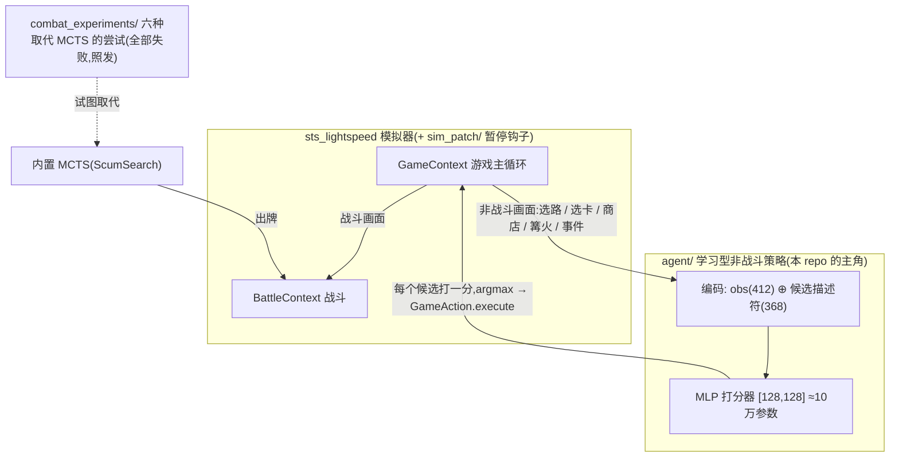

# sts-rl-agent — 《杀戮尖塔》的学习型策略(基于 sts_lightspeed)

[English](README.md) | 中文

一个跑在 [sts_lightspeed](https://github.com/gamerpuppy/sts_lightspeed) 模拟器上的《杀戮尖塔》混合 agent(A0 铁甲战士):

- **一个从零训练的小网络(约 10 万参数)做全部非战斗决策**——地图选路、奖励选卡、商店、篝火、事件,REINFORCE 训练;
- **战斗交给模拟器内置的 MCTS(ScumSearch)**。

据我们所知,这是**第一个针对 sts_lightspeed 神经网络接口(412 维 `NNInterface` 观测)公开发布的、能用的学习型策略**——模拟器作者留了接口,但从未公开过训好的权重。它**不是** SOTA,也不声称是,诚实的局限见文末。

下方成绩和仓库内权重属于历史 A0 接口。当前开发路线为铁甲战士 A20 至心脏，观察与动作合同发生变化；验证状态和剩余门槛见 [`sim_patch/alignment/`](sim_patch/alignment/)。

**2026-09-20 开发状态：E116 修复炸弹实例丢失。** 263 项回归、31 项补丁重建检查、四组原版控制序列及一条预选自然心脏路线通过；整局原版动作、局外选择与 12 路终局 RNG 匹配。E112 停止，E113／E114 关闭，允许登记新来源。这是规则修复证据，50% 未见种子目标未完成；长任务每 20 分钟检查。[修复报告](sim_patch/alignment/e116-bomb-instance-report.json)、[当前状态](docs/ironclad-training-status.md)。

E60（2026-09-18）的历史模拟器结果：同一批 1,024 个未见根种子，原局外策略为 **83/1,024（8.1055%）**，学习第一幕 Boss 遗物选择后为 **112/1,024（10.9375%）**；新增 40 胜、损失 11 胜，净增 29，配对精确 p=5.7038e-5。两组共享有界重规划战斗器，每次搜索 8,000／Boss ×3；整局搜索量增加 **0.69%**。

学习部分是 22 件遗物和跳过的 23 个分数，信号来自同一局面下的完整续局输赢；原 1,061,953 参数网络保持原权重，负责后续局外选择。两组 2,048 个自然终局的状态／RNG 重放通过，195 次胜局重规划和钥匙／双 Boss／第四幕／局外决策核验通过，执行故障 0。采用门槛和**样本 10% 目标通过**；候选的 95% Wilson 区间为 **9.17%—13.00%**，这份证据没有把总体胜率下限推到 10%。原版 Java 全链路一致性状态为 INCOMPLETE。

**E61 第二批独立复测**保持两组策略和战斗运行时不变，使用另外 1,024 个未见种子：原策略 **92/1,024（8.9844%）**，当前模型 **121/1,024（11.8164%）**；新增 47 胜、损失 18 胜，净增 29，配对精确 p=0.00042213。2,048 个终局重放及 213 次胜局重规划通过，对局故障 0。预定复测门槛与样本 10% 目标通过，候选的 95% Wilson 区间为 **9.98%—13.94%**。本批独立报告，没有训练或更换模型；见 [E61 结果及报告故障修复记录](runs/heart-first-boss-retest-20260918-01/复测结果.md)。

**E62 原版一致性验收未通过。** 对上述 121 条成功路线从原版自然开局执行相同动作，91 条出现行为或随机数差异，7 条出现选牌输入差异，19 条出现影响取决于后续动作的费用状态差异，4 条出现排除棱彩碎片导致的商店供应差异。每条在首个被捕捉分歧处停止，未赋原版胜负标签；11.8164% 保留为模拟器成绩，不能代表原版成功率。证据与覆盖限制见 [E62 核验报告](../ironclad-alignment/evidence/e61-success-parity-20260918-01/一致性核验结果.md)。

复用入口为 [所选运行时](runs/heart-first-boss-confirmation-20260918-01/selected-runtime.json)。使用具备 PyTorch 的 macOS arm64 Python 3.12，运行 `agent/heart_play_selected.py --selection <selection.json> --seed <seed> --output <新目录>`；入口核对引擎、权重和实验身份，保存完整对局及终态重放证据。见 [E60 结果与复现命令](runs/heart-first-boss-confirmation-20260918-01/验收结果.md)、[遗物策略](agent/heart_boss_relic_model.py)与[有界重规划补丁](sim_patch/search_replanning_limit.patch)。已见种子的入口检查重现心脏胜利，208 次局外决策吻合。

E54 的 34→68/1,024 来自另一批新根，不能与本轮结果当作配对对照；其[结果与补丁](runs/heart-bounded-loss-confirmation-20260918-01/验收结果.md)保留。E55 故障、E56 训练阻塞和 E57 无条件执行败局方案的拒绝判定保留。下文按原范围保留历史实验。

A20 的首轮容量对照使用 7625 维输入，比较 992769 与 4167681 个参数的模型；当前动作对照使用 1,061,953 参数模型。[实验排查账本](../铁甲战士项目路线与RL实验.md#experiment-diagnosis)记录每轮假设、干预、结果、能排除的原因和剩余缺口。

2026-09-17 的 E25 在排除 43,062 个历史及预留种子后，使用 1,024 个未见根种子配对评估。局外网络相同，每次 MCTS 搜索 8,000、Boss ×3。上轮接受的战斗配置为 **20/1,024（1.9531%）**，出牌顺序推演版本为 **33/1,024（3.2227%）**；新增 23 胜、损失 10 胜，配对精确检验 p=0.035082。两组 2,048 局的状态／RNG 重放通过，53 次胜局从开局重跑网络与 MCTS 一致，钥匙／双 Boss／心脏链路和胜局全部局外网络选择核验通过，执行故障 0。

改动是让随机推演抽到牌动作时，以 50% 概率参考现有出牌顺序；合法搜索分支和动作类型概率保留，局外权重相同。每次搜索预算相同，整局总搜索量增加 7.28%。该配置通过预设采用门槛，作为下一轮训练的战斗基线；**10% 目标未达到**。见 [E25 验收结果](runs/heart-order-acceptance-20260917-01/验收结果.md)、[运行时决定](runs/heart-order-acceptance-20260917-01/decision.json)和[增量补丁](sim_patch/search_order.patch)；增量补丁在 [search_rollout.patch](sim_patch/search_rollout.patch) 后应用。

E32 保留该搜索策略与局外模型，把继承的 Python 绑定对象按 `-O2` 重建。O0 源码控制的模块与 E25 逐字节相同；两份重建版本各通过 256 单战与 64 条自然完整路线的动作、搜索量、终态和 RNG 核对。在 16 个固定战前状态、8 轮平衡配对测试中，搜索耗时降幅中位数为 **7.05%**，按轮 bootstrap 95% 区间 **6.90%—7.19%**，通过 5% 预设门槛。O2 产物在 E54 之前作为实验运行时。这是固定负载的搜索耗时收益，不是整套训练吞吐率或新的心脏胜率；33/1,024 的未见成绩来自 E25 的前一产物。见 [E32 结果](runs/heart-binding-validation-20260917-01/优化结果.md)和[E32 历史运行时](runs/heart-binding-validation-20260917-01/decision.json)。E26／E27 降低探索系数在 1,024 个训练根上为 48→50 胜，但损失原胜局 24 个，未过门槛；E29 目标偏好与 E30／E31 源码优化也未达到各自门槛，没有合入。

E33 在同一 240 个训练家庭上比较原类别抽样与“取结局前最后两个决策”。去重后的 3,030 条续局和 918 个原动作控制通过重放核验；192 个失败家庭中，两组找到获胜替代动作的数量为 15／16，配对 p=1。逆序组可救拟合家庭 11<24，未过覆盖门槛，训练更新 0、模型保持。逆序组在本面板的续局搜索量少 51.11%，不代表学习效果或全流程吞吐率提高。见 [E33 采样结果](runs/heart-decision-sampling-20260917-01/采样结果.md)。

[E19](runs/heart-search-acceptance-20260917-01/验收结果.md) 的 5→31 来自另一批 1,024 个种子，不与本轮 33 胜直接相减。训练开发中，E20 后期新模型为 25→20，E24 单次改选重建为 24，均未过门槛；第四幕四倍预算搜索量为 4.10 倍，成功数 25→26，未采用。这些阴性结果保留在账本中。以上为模拟器结果，原版 Java 一致性状态为 INCOMPLETE；下方历史 A0 成绩不适用于当前实验。

## 历史 A0 架构



一句话:**游戏循环按画面路由**——非战斗决策走学习型打分器(对当前画面的每个候选动作打分、选最高),战斗仍由搜索(MCTS)执行;`combat_experiments/` 里是我们用六种方法试图把战斗也学进网络的完整记录(全部失败,作为负结果公开)。

## 核心结果

同样的 MCTS 战斗、同样的 50 个留出关卡、A0 铁甲——只换"非战斗的脑子":

| 非战斗决策 | 战斗 | 平均楼层 | 通关率 |
|---|---|---|---|
| 内置启发式(地图=随机) | MCTS @2000 | 22.8 | 2% |
| 内置启发式(地图=随机) | MCTS @50000 | 31.2 | 6% |
| **学习型策略(本 repo)** | MCTS @2000 | **38.5** | 4% |
| **学习型策略(本 repo)** | MCTS @50000 | **42.5** | **14%** |

在这份历史 A0 样本的 50,000 次搜索对照中，学习型非战斗决策将平均楼层从 **31.2 提高到 42.5**。

## 真实 Steam 闭环

`steam/` 把同一策略接入真实 Steam 客户端：CommunicationMod 提供状态与命令，
companion mod 导出精确 RNG，`steam_mcts.py` 从真实快照恢复 `BattleContext` 并执行
`MCTS@2000`。学习模型仍只负责战斗外决策；两组战斗使用同一在线搜索。

单个高反差 seed `BTRU46` 的真实结果是 random 第 7 层失败、learned 第 51 层通关。
这是集成案例，不替代上面的 50-seed 模拟器对照。安装与运行见
[`steam/README.md`](steam/README.md)。

## 过程与可审计证据

- [`docs/journey.md`](docs/journey.md)：从 LLM+记忆 Agent 收缩到小策略网络。
- [`docs/evaluation.md`](docs/evaluation.md)：训练/评估 seed 泄漏与修正后的评估边界。
- [`docs/training-lessons.md`](docs/training-lessons.md)：容量、训练曲线、早停与学习/规划分界。
- [`results/`](results/)：精简训练指标、MCTS 预算对照和可重绘曲线。

## 目录结构

```
agent/                 非战斗策略(能用的那部分)
  armG_train.py            A20 统一打分器: f(obs6820 ⊕ 候选805) → 分
  heart_train.py           A20 冻结实验、预训练、候选续局与心脏训练
  heart_capacity.py        固定数据的网络容量对照
  heart_expand.py          自然后期节点扩展、心脏训练与配对评估
  armG_train_parallel.py   历史按层数奖励的 REINFORCE 管线
  armS_train*.py           更早的"只选卡"版本(天花板≈35层)
combat_experiments/    六种把战斗学进网络的尝试——全部是负结果,有意公开
  armB_train*.py           行为克隆 MCTS   → 模仿准确率0.59,实战~12层
  armB_dagger.py           DAgger          → 无改善(标签本身不可学)
  armB_rl.py               REINFORCE 微调  → ~12层
  armB_attn*.py            注意力/token    → ~14层
  armB_value*.py           价值网+1步前瞻  → ~8层(比不前瞻还差)
  armB_mcts.py             策略+价值引导PUCT → 随算力涨,但同预算输给盲搜(26.7 vs 33)
  armB_selfplay.py         自对弈循环(未能拉起)
eval/                  评测协议
  eval_seeds_50.txt        固定50个留出seed(README里所有数字都用它)
  armB_blind.py            混合agent评测(学习非战斗+MCTS战斗),ASC 环境变量调难度
  native_bot_eval.py       原生 ScumSearch bot 在同样seed上的成绩(上表基线)
  death_analysis.py        死亡分析(剧透:都死在boss)
weights/               训好的权重(都是小MLP,单个<2MB)
  armG_model_G128x128_15k.pt   ← 核心结果背后的非战斗策略
sim_patch/             对 sts_lightspeed 的改动
  sim_rl_hooks.patch
steam/                 真实 Steam 状态桥接 + MCTS 控制
results/               可审计的小型指标与曲线
docs/                  过程、评估边界和训练经验
```

## 有意思的负结果

我们用六种方法试图把 MCTS 的战斗棋力蒸馏进前馈网络,全部以同样的方式失败:

- 模仿学习拟合不了老师(训练准确率卡死在 ~0.44):MCTS 模拟时用的是**这局真实的未来抽牌顺序**——老师事实上"看得见未来",只看当前一帧的策略学不像;
- RL、注意力、价值前瞻全部在远低于老师的位置走平;
- 策略+价值引导的 PUCT 搜索确实"越搜越强",但**同样搜索预算下输给纯随机模拟的盲搜**——半吊子网络会把树带偏。

结论:**判断型决策(选路/购物/组牌)很容易压进小网络;规划型决策(战斗出牌序列)会抵抗**——它似乎必须要完整的 AlphaZero 式自对弈体系,而这个游戏上还没有人公开做成过。这就是开放的无人区。

难度阶梯(混合 agent,sim2000):A0 38.5 → A5 33.4 → A10 30.1 → A20 25.7(A20 通关率 0%;顶尖人类超过五成)。

## 复现

1. 克隆 [sts_lightspeed](https://github.com/gamerpuppy/sts_lightspeed) 并打三份 patch（包含统一局外暂停钩子、通用 `GameAction` 绑定、`get_legal_game_actions`、`mcts_recommend` 神谕和状态访问）：

   ```bash
   git clone https://github.com/gamerpuppy/sts_lightspeed && cd sts_lightspeed
   git checkout 7476a81
   git apply /path/to/sim_patch/sim_rl_hooks.patch
   git apply /path/to/sim_patch/combat_rules.patch
   git apply /path/to/sim_patch/ironclad_a20.patch
   mkdir build312 && cd build312 && cmake .. && make -j4   # 需要 pybind11 子模块 + python3.12
   ```

2. 通过 `.env.example` 设置 `STS_LIGHTSPEED_BUILD`，检查当前 A20 的观察与候选合同：

   ```bash
   python tests/test_armg_contract.py -v
   ```

A20 模型输入为 7625 维：6820 维局面观察加 805 维候选描述。`agent/armG_train.py` 默认使用 `ASC=20`，奖励、三把钥匙、Boss 遗物、宝箱、选牌子界面、商店、事件、篝火和地图选择都交给同一打分器。本轮排除的棱彩碎片在完整商店遗物池洗牌后移除，保留这次洗牌的随机数消耗和其他遗物的相对顺序，但会移动后续商品的供应位置；E62 在 4 条路线观察到购买候选不同。发布的 A0 权重要求旧的 412 + 368 输入，不能加载到新模型。`armG_train_parallel.py` 仍用 `floor / 50` 作为奖励，在替换为候选动作后的完整续局结果和心脏评估协议前，只用于管线检查。

Python 依赖:`torch`、`tensorboard`(仅训练)。

历史首轮模拟器实验使用 `agent/heart_train.py` 和 `configs/heart_round1.json`：先预训练固定局外打法，再从自然可达后期节点采集各候选的完整续局结果。心脏胜利记 1，死亡和缺钥匙终局记 0，异常和截断不作为标签；层数只做诊断。足够的训练／验证种子出现有赢有输的分支后才训练心脏评分器。下列命令是历史实验入口；当前判断和后续待验证原因见 [实验记录](../铁甲战士项目路线与RL实验.md#experiment-diagnosis)。

```bash
python tests/test_heart_training.py -v
python agent/heart_train.py launch configs/heart_round1.json runs/heart-round1-my-run
```

启动器冻结源码和模拟器，使用 4 个工作进程，采样预算 30 分钟。实验目录中的 `status.json`、`metrics.jsonl` 和 `report.json` 记录状态；`bootstrap.pt` 是启发式模仿预训练，不是心脏胜负训练的模型。

第二轮通过 `heart_expand.py` 和 `configs/heart_round2.json` 扩大后期决策覆盖，保留首轮种子归属和搜索预算。成功分支的后续状态通过完整动作重放恢复；同一种子派生的节点留在同一分区。达到多个训练／验证种子的胜负信号门槛后，两个容量使用同一批标签训练。完整开局评估分别测试全程网络和第 25 层起使用网络的课程策略，避免把后期续局胜率当作自然通关率。

第二轮配置使用 8 个采样进程，每进程 PyTorch 1 个线程。本机 32 个训练种子的两轮配对测速中，4／8 并发的平均耗时为 11.78／7.97 秒，采样吞吐提高 47.9%；动作、观测、终局和 RNG 轨迹一致。测速入口为 `heart_benchmark.py`，测试进程应独占采样 CPU 负载以保证可比。切换正在运行的实验时，须等在途进程写完结果并停止旧控制器；`reschedule` 保留完成的数据、种子划分和原采样截止时间，并生成新的冻结实验目录。

```bash
python -m unittest discover -s tests -p 'test_heart*.py'
python agent/heart_capacity.py launch runs/round1 runs/capacity --width 512
python agent/heart_expand.py launch runs/round1 runs/capacity configs/heart_round2.json runs/round2
python agent/heart_benchmark.py runs/round2 runs/concurrency-check --seeds 32
```

采样结束后若胜负信号缺少独立种子，可在新目录补采，保留旧分区、完成数据与故障证据：

```bash
python agent/heart_expand.py extend runs/round2 runs/round2-more --validation-seeds 512
python agent/heart_audit.py runs/round2-more runs/round2-more/data-audit.json
python agent/heart_assess.py runs/round2-more
```

`heart_assess.py` 用于训练和自然开局评估完成后的权重／指标核验。所有候选的续局胜率属于固定后续策略下的条件指标，完整开局表现通过独立的配对运行报告。

`heart_policy.py` 对照了另一种策略改进目标：终局相同保留启发式选择，仅在原选择输、其他候选赢时修改选择目标；保留模仿预训练输出层，补充前缀示范。两种容量在这组评估种子中的锻造／取消循环截断降为 0，但心脏通关仍为每模型每模式 0／64。训练检查共 18 项通过，详细结果见项目训练记录。

```bash
python agent/heart_policy.py launch runs/heart-score-complete runs/policy-improvement
python agent/heart_loop_diagnostics.py runs/policy-improvement
```

权重也镜像在 HuggingFace:[Jialeiv/sts-rl-agent](https://huggingface.co/Jialeiv/sts-rl-agent)。

## 诚实的局限

- 发布成绩只覆盖 A0 铁甲；A20 至心脏路线只考虑铁甲并排除棱彩碎片，原版全内容对齐仍未完成；
- 战斗仍然是搜索(MCTS),不是学出来的——学习的部分是战斗**之外**的一切;
- "最强公开 bot"指原生 sts_lightspeed ScumSearch agent 在我们的 seed 上的实测,换 seed 集数字会不同;
- 50 个固定 seed 的单次结果,没有置信区间。

## 致谢与协议

- 模拟器:[gamerpuppy/sts_lightspeed](https://github.com/gamerpuppy/sts_lightspeed)(MIT)——没有它就没有这个项目;
- 真实游戏桥接:[ForgottenArbiter/CommunicationMod](https://github.com/ForgottenArbiter/CommunicationMod)、[ModTheSpire](https://github.com/kiooeht/ModTheSpire)、[BaseMod](https://github.com/daviscook477/BaseMod);
- 本仓库:MIT。《杀戮尖塔》(Slay the Spire)是 Mega Crit Games 的商标;本项目是基于净室模拟器的非官方研究项目。

完整鸣谢见 [`docs/acknowledgements.md`](docs/acknowledgements.md)。

中文过程记录(全系列):见 *Slow Take* 的博客系列。

战士战斗规则补丁与原生回归命令见 [`sim_patch/README.md`](sim_patch/README.md)。已发布评估数据来自该规则补丁之前，尚未重新测量分数。
