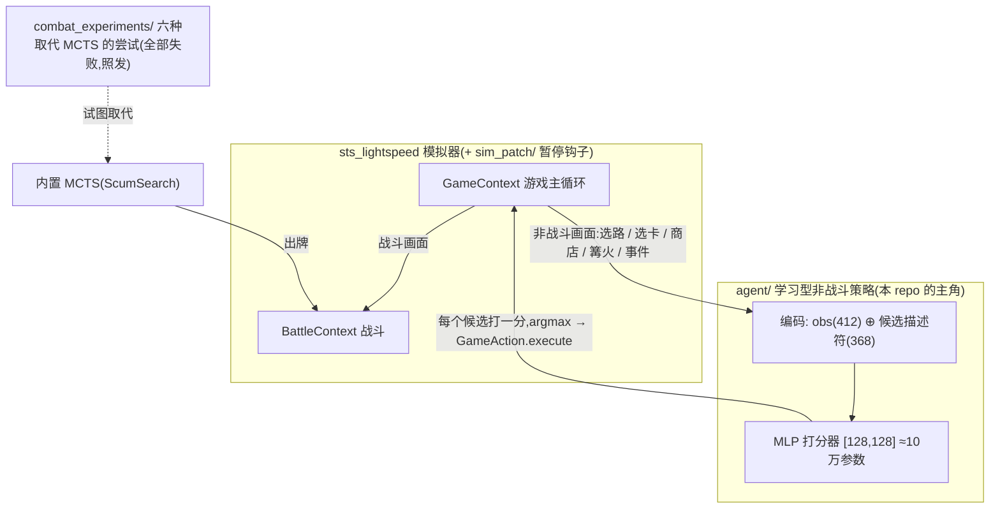

# sts-rl-agent — 《杀戮尖塔》的学习型策略(基于 sts_lightspeed)

[English](README.md) | 中文

一个跑在 [sts_lightspeed](https://github.com/gamerpuppy/sts_lightspeed) 模拟器上的《杀戮尖塔》混合 agent(A0 铁甲战士):

- **一个从零训练的小网络(约 10 万参数)做全部非战斗决策**——地图选路、奖励选卡、商店、篝火、事件,REINFORCE 训练;
- **战斗交给模拟器内置的 MCTS(ScumSearch)**。

据我们所知,这是**第一个针对 sts_lightspeed 神经网络接口(412 维 `NNInterface` 观测)公开发布的、能用的学习型策略**——模拟器作者留了接口,但从未公开过训好的权重。它**不是** SOTA,也不声称是,诚实的局限见文末。

## 整体架构



一句话:**游戏循环按画面路由**——非战斗决策走学习型打分器(对当前画面的每个候选动作打分、选最高),战斗仍由搜索(MCTS)执行;`combat_experiments/` 里是我们用六种方法试图把战斗也学进网络的完整记录(全部失败,作为负结果公开)。

## 核心结果

同样的 MCTS 战斗、同样的 50 个留出关卡、A0 铁甲——只换"非战斗的脑子":

| 非战斗决策 | 战斗 | 平均楼层 | 通关率 |
|---|---|---|---|
| 内置启发式(地图=随机) | MCTS @2000 | 22.8 | 2% |
| 内置启发式(地图=随机) | MCTS @50000 | 31.2 | 6% |
| **学习型策略(本 repo)** | MCTS @2000 | **38.5** | 4% |
| **学习型策略(本 repo)** | MCTS @50000 | **42.5** | **14%** |

学习型非战斗层比原生 bot 的启发式**高出约 11 层**——它最大的软肋从来不是打牌,而是选路基本靠随机。

## 真实 Steam 闭环

`steam/` 把同一策略接入真实 Steam 客户端：CommunicationMod 提供状态与命令，
companion mod 导出精确 RNG，`steam_mcts.py` 从真实快照恢复 `BattleContext` 并执行
`MCTS@2000`。学习模型仍只负责战斗外决策；两组战斗使用同一在线搜索。

单个高反差 seed `BTRU46` 的真实结果是 random 第 7 层失败、learned 第 51 层通关。
这是集成案例，不替代上面的 50-seed 模拟器对照。安装与运行见
[`steam/README.md`](steam/README.md)。

## 过程与可审计证据

- [`docs/journey.md`](docs/journey.md)：从 LLM+记忆 Agent 收缩到小策略网络。
- [`docs/evaluation.md`](docs/evaluation.md)：训练/评估 seed 泄漏与修正后的评估边界。
- [`docs/training-lessons.md`](docs/training-lessons.md)：容量、训练曲线、早停与学习/规划分界。
- [`results/`](results/)：精简训练指标、MCTS 预算对照和可重绘曲线。

## 目录结构

```
agent/                 非战斗策略(能用的那部分)
  armG_train.py            统一打分器: f(obs412 ⊕ 候选描述符) → 分
  armG_train_parallel.py   12 进程 REINFORCE 训练器(随机seed、固定eval集、checkpoint)
  armS_train*.py           更早的"只选卡"版本(天花板≈35层)
combat_experiments/    六种把战斗学进网络的尝试——全部是负结果,有意公开
  armB_train*.py           行为克隆 MCTS   → 模仿准确率0.59,实战~12层
  armB_dagger.py           DAgger          → 无改善(标签本身不可学)
  armB_rl.py               REINFORCE 微调  → ~12层
  armB_attn*.py            注意力/token    → ~14层
  armB_value*.py           价值网+1步前瞻  → ~8层(比不前瞻还差)
  armB_mcts.py             策略+价值引导PUCT → 随算力涨,但同预算输给盲搜(26.7 vs 33)
  armB_selfplay.py         自对弈循环(未能拉起)
eval/                  评测协议
  eval_seeds_50.txt        固定50个留出seed(README里所有数字都用它)
  armB_blind.py            混合agent评测(学习非战斗+MCTS战斗),ASC 环境变量调难度
  native_bot_eval.py       原生 ScumSearch bot 在同样seed上的成绩(上表基线)
  death_analysis.py        死亡分析(剧透:都死在boss)
weights/               训好的权重(都是小MLP,单个<2MB)
  armG_model_G128x128_15k.pt   ← 核心结果背后的非战斗策略
sim_patch/             对 sts_lightspeed 的改动
  sim_rl_hooks.patch
steam/                 真实 Steam 状态桥接 + MCTS 控制
results/               可审计的小型指标与曲线
docs/                  过程、评估边界和训练经验
```

## 有意思的负结果

我们用六种方法试图把 MCTS 的战斗棋力蒸馏进前馈网络,全部以同样的方式失败:

- 模仿学习拟合不了老师(训练准确率卡死在 ~0.44):MCTS 模拟时用的是**这局真实的未来抽牌顺序**——老师事实上"看得见未来",只看当前一帧的策略学不像;
- RL、注意力、价值前瞻全部在远低于老师的位置走平;
- 策略+价值引导的 PUCT 搜索确实"越搜越强",但**同样搜索预算下输给纯随机模拟的盲搜**——半吊子网络会把树带偏。

结论:**判断型决策(选路/购物/组牌)很容易压进小网络;规划型决策(战斗出牌序列)会抵抗**——它似乎必须要完整的 AlphaZero 式自对弈体系,而这个游戏上还没有人公开做成过。这就是开放的无人区。

难度阶梯(混合 agent,sim2000):A0 38.5 → A5 33.4 → A10 30.1 → A20 25.7(A20 通关率 0%;顶尖人类超过五成)。

## 复现

1. 克隆 [sts_lightspeed](https://github.com/gamerpuppy/sts_lightspeed) 并打 patch(新增 `pause_on_map/rest/shop/event/battle` 钩子、通用 `GameAction` 绑定、`get_legal_game_actions`、`mcts_recommend` 神谕、牌堆访问):

   ```bash
   git clone https://github.com/gamerpuppy/sts_lightspeed && cd sts_lightspeed
   git checkout 7476a81
   git apply /path/to/sim_patch/sim_rl_hooks.patch
   git apply /path/to/sim_patch/combat_rules.patch
   mkdir build312 && cd build312 && cmake .. && make -j4   # 需要 pybind11 子模块 + python3.12
   ```

2. 通过 `.env.example` 设置 `STS_LIGHTSPEED_BUILD`,然后:

   ```bash
   # 用发布的非战斗策略 + MCTS 战斗,在 50 个 eval seed 上评测
   python eval/armB_blind.py 2000,50000 12
   # 从零重训非战斗策略(笔记本 12 核约 10 分钟)
   STS_SIM_COUNT=2000 PROG_TAG=my_run python agent/armG_train_parallel.py 8000 12 32
   ```

Python 依赖:`torch`、`tensorboard`(仅训练)。

权重也镜像在 HuggingFace:[Jialeiv/sts-rl-agent](https://huggingface.co/Jialeiv/sts-rl-agent)。

## 诚实的局限

- 只测了 A0(最低难度)、只有铁甲(上游模拟器只完整实现了铁甲,其他角色的卡是空壳);
- 战斗仍然是搜索(MCTS),不是学出来的——学习的部分是战斗**之外**的一切;
- "最强公开 bot"指原生 sts_lightspeed ScumSearch agent 在我们的 seed 上的实测,换 seed 集数字会不同;
- 50 个固定 seed 的单次结果,没有置信区间。

## 致谢与协议

- 模拟器:[gamerpuppy/sts_lightspeed](https://github.com/gamerpuppy/sts_lightspeed)(MIT)——没有它就没有这个项目;
- 真实游戏桥接:[ForgottenArbiter/CommunicationMod](https://github.com/ForgottenArbiter/CommunicationMod)、[ModTheSpire](https://github.com/kiooeht/ModTheSpire)、[BaseMod](https://github.com/daviscook477/BaseMod);
- 本仓库:MIT。《杀戮尖塔》(Slay the Spire)是 Mega Crit Games 的商标;本项目是基于净室模拟器的非官方研究项目。

完整鸣谢见 [`docs/acknowledgements.md`](docs/acknowledgements.md)。

中文过程记录(全系列):见 *Slow Take* 的博客系列。

战士战斗规则补丁与原生回归命令见 [`sim_patch/README.md`](sim_patch/README.md)。已发布评估数据来自该规则补丁之前，尚未重新测量分数。
